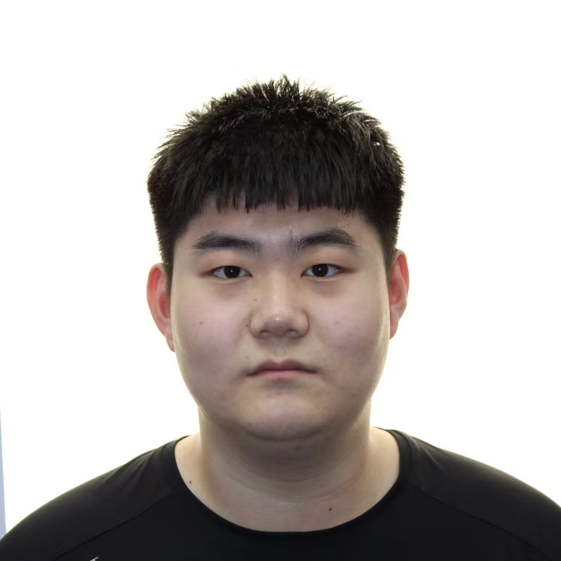

## Summary

On December 6, 2025, my hero provided two assists in the MLS final and helped his team win the championship. This was his 48th championship. 

Lionel Messi is one of the greatest football players in history. As a fan of his, I have witnessed countless miracles and records being created over the past 15 years. Messi's greatness has transcended the realm of football and has become a cultural symbol. With the advancement of data analysis and machine learning technologies, quantitative research has become an important tool for evaluating players' performances, optimizing tactical decisions, and predicting future trends. we can use various data analysis techniques to understand the greatness of this legendary player. This project analyzed the match data of Messi and employed a variety of data analysis tools.

## Who would be interested in this?

- Football enthusiasts, especially fans of Messi
- Football match data analysis professionals

## Key Topics and technologies
- Data collecting
- Data cleaning
- Exploratory Data Analysis
- Data Visualization
- K-Means Clustering
- Dimensionality Reduction
- Regression
- Decision Tree 
- Classificaiton
- Predictive Models
- Unsupervised learning
- Supervised learning

## Literature review

Lionel Messi is widely seen as one of the greatest football players of the modern era. Over the past two decades, he has collected an extraordinary number of achievements. His impact is not limited to the matches he plays—he has also shaped football culture around the world, influenced media discussions, and built a massive global fan community. Because of this, Messi has become a valuable subject for research on football skills and performance data[@Yarrow2016ThePO]. In recent years, with the popularity of artificial intelligence, the use of mathematical models and statistical methods to study football has become increasingly common. As a top player, Messi has naturally attracted much attention in this field. A study examined his athletic skills and found that the sequence of movements he involved in shooting, dribbling, and organizing attacks were both complex and highly consistent. Through T-shaped pattern detection and polar coordinate analysis, the researchers discovered that his movements formed a closely connected chain in terms of time and space[@Castaer2017MasteryIG]. 

For this project, I will apply the data science knowledge learned in class to a real-world problem by conducting a systematic analysis of Messi’s career data. This will include data collection and cleaning, exploratory data analysis and visualization, clustering and dimensionality reduction, as well as regression, decision tree methods, and predictive modeling.

## About Me

### Mingyang Han

Mingyang Han is a first-year graduate student at Georgetown University pursuing a Master’s in Data Science and Analytics. He received a Bachelor of Science degree from the University of Liverpool in July 2025. Han is passionate about applying data-driven methods to solve real-world problems and aspires to work as a data scientist or operations analyst. Outside of academics, he is a dedicated fan of Lionel Messi and follows football closely.

**Education:**

-   2025: University of Liverpool - B.Sc. in Science\
-   2025-2027 (Expected): Georgetown University - M.S. in Data Science and Analytics

{.center width="50%"} 

### Personal statement and project intention

I have been a fan of Lionel Messi for 15 years. In 2009, when I was six years old, I watched the Champions League final — my first football match — and I was deeply attracted by Messi’s amazing talent. I admire not only his skills but also his humble and kind personality, which has influenced me as I grew up. Research has shown that Messi’s fans often see him as a “naturally gifted player” and a “humble person,” and this connection comes not only from emotion but also from the strong skills and smart decisions he shows in games[@Zhou2024AnalyzingEF].

In this project, I hope to combine my personal interest with the data science knowledge I learned in class. I will use data analysis and machine learning methods to study sports data and explore Messi’s career in a systematic and meaningful way.

