## Introduction

This is a project that I am extremely excited about. As a long-time fan of Messi, I have always admired this great player. In the past, I mostly experienced Messi's greatness through game footage, emotions and memories. But now, as a graduate student of data science and analysis program, I have learned a lot of data analysis techniques. This has enabled me to appreciate my idol from a completely new and more objective perspective.

Another significance of this project is that it enables me to truly apply what I have learned in class to real-world problems. From data collection to cleaning, modeling, and result interpretation, each step is a process of converting theory into practice. Completing a complete data analysis project independently is more meaningful and independent than just watching others' work. Although the difficulty and depth of this project are not particularly high, it was indeed my first attempt. I believe this project will be of great significance for my future studies and work.

## Objective 

The main objective of this project is to apply advanced data science techniques to start a quantitative analysis of Lionel Messi's performance over multiple seasons. Specific goals include:

- **Data collect**: Use multiple approaches to collect reliable data, such as web scraping, public football databases, and API-based data extraction. 

- **Data cleaning**: Perform data preprocessing, deal with missing values and outliers, use data standardization and normalization.

- **EDA**: Use visual charts to present Messi's various data and performance trends.

- **Unsupervised learning**:  dimension reduction and clustering

- **supervised learning**: Regression and classification

## Key Findings

### Dimensionality Reduction

- **PCA** The first 5 principal components account for approximately 90% of the variance.
- **t-SNE** t-SNE is better than PCA at clearly showing the independent clusters formed by large-number-data samples.

### Clustering

- **K-means** k = 2 is suitable for this dataset
- **DBSCAN** the best clustering method for this project, showing the noise points clearly
- **Hierarchical Clustering** 2-cluster result performs best globally; 6-cluster result reveals local structures.

### Regression

- **Linear Regression** The predictions for goals were very accurate, while assists were significantly influenced by non-linear factors.
- **Decision Tree Regressor** Regression trees can capture complex nonlinear relationships, but they are prone to overfitting.
- **Multi-output Decision Tree** The multi-output regression tree demonstrated reasonable error levels on rank_in_league_top_attackers, rank_in_league_top_midfielders and rank_in_club_top_scorer
- **Multi-output Random Forest** Performed well in predicting these four ranking indicators(above three and rank_in_league_top_defenders)

### Classification

- **Multi-output Decision Tree** It is accurate in predicting frequent events(yellow cards), but dont do well in predicting rare events (such as penalties)

- **Multi-class Decision Tree** The accuracy and recall rate of the low-efficiency and medium-efficiency samples are stable but the prediction performance of the high-efficiency samples are worse.

## Methodology Overview

### Data

The data used in this project is sourced from [Wikipedia](https://en.wikipedia.org/wiki/Lionel_Messi) and [FootyStats](https://footystats.org/players/argentina/lionel-messi), covering Lionel Messi's professional performance statistics across multiple seasons, different competitions and clubs. It includes five CSV files and one JSON file. Data cleaning involves handling missing values and outliers, standardizing season and competition formats, calculating derived metrics (such as goals per 90 minutes and goal participation rate), and normalizing different statistical standards. The missing data are normalized through the replacement of special characters, numerical forced conversion, and the handling of categorical and critical missing values.

After data leaning, I applied various visualization methods to conduct exploratory data analysis (EDA) on the data, in order to visually present the performance characteristics of Messi across different seasons, clubs and types of competitions.

### Unsupervised Learning

High-goal matches are mostly found in areas with high PC1 and PC2 near zero, meaning these games have high total playing time and contributions, while efficiency is around average. Low-goal matches appear in areas with low PC1 and a wide range of PC2, showing more varied performance, with efficiency that can be high or low but overall lower total contributions.

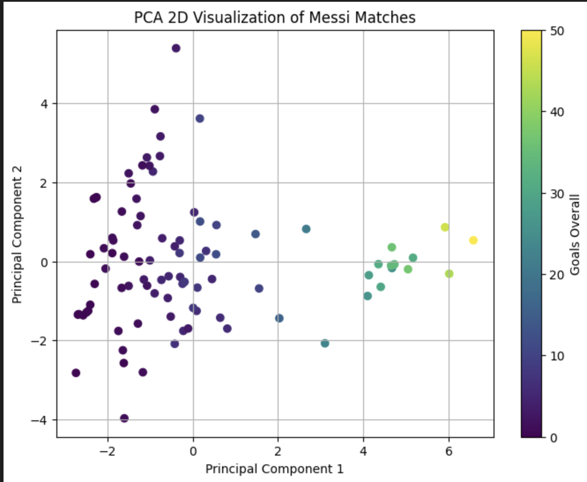

The 2D visualization of t-SNE shows that the samples of games with high goals are clustered in the upper left corner of the graph, indicating that they have similar feature patterns in the high-dimensional feature space; while the samples with low goals are more scattered, suggesting that their features are quite different.

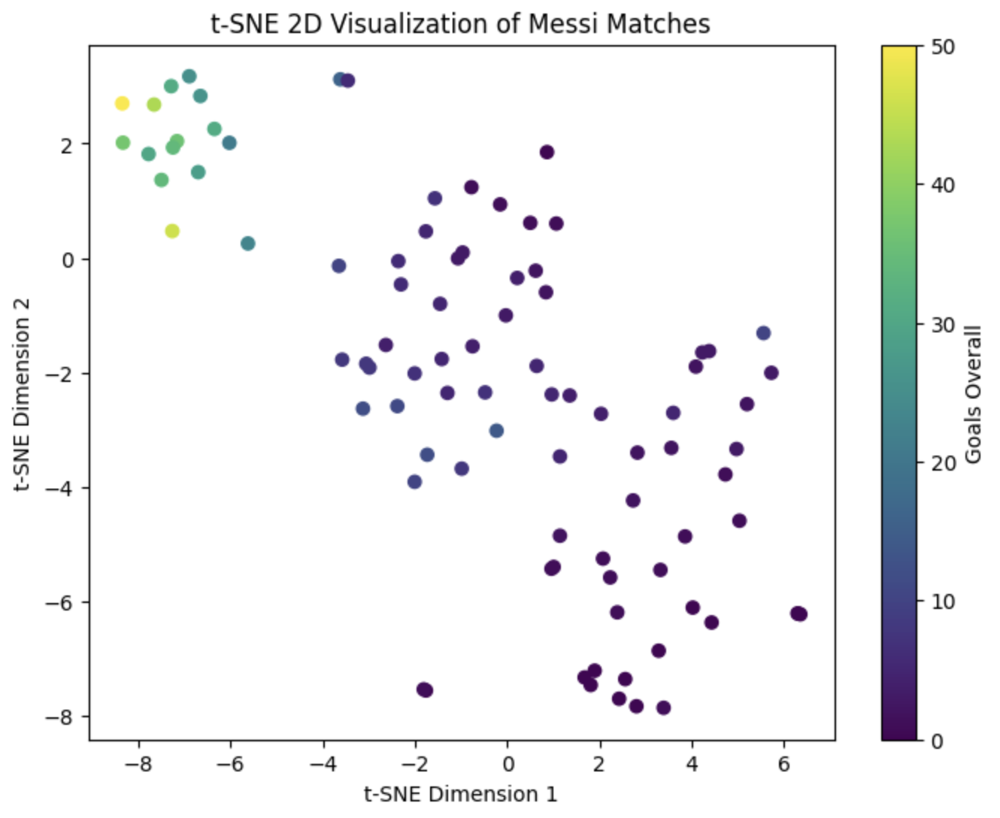

The samples are clearly divided into two clusters. One cluster corresponds to samples with high goals, high assists, and high playing time, while the other cluster corresponds to samples with low goals and low contributions. However, the separation between different clusters is not obvious, and there are outliers, such as in the word "visualization" in the title, where the two points directly below the letter "n" in the middle are very close and belong to different clusters, which proves that the separation between different clusters is not complete.

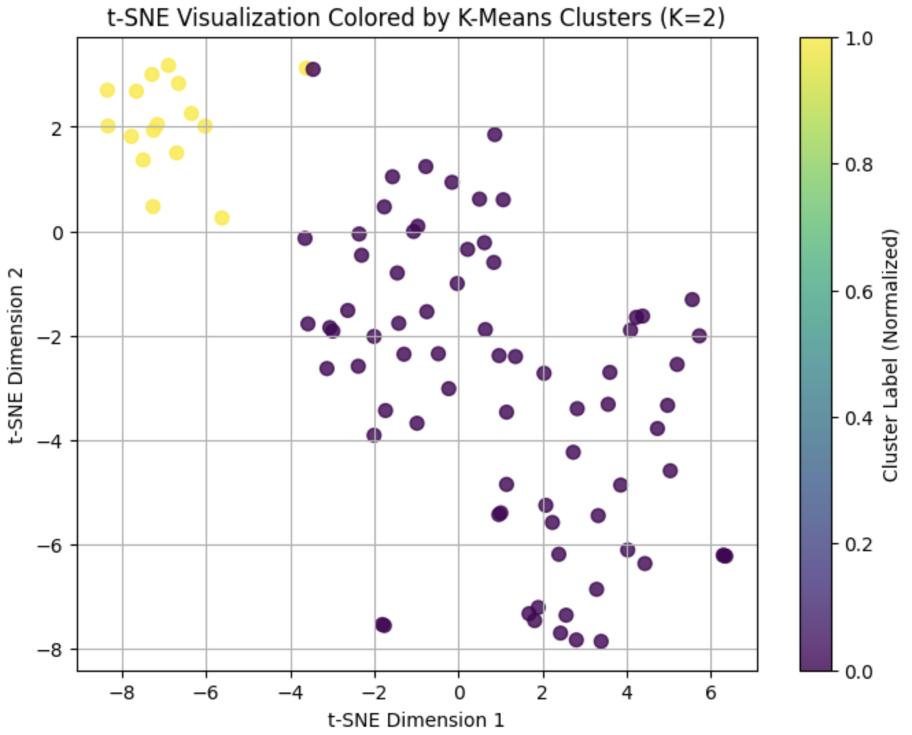

The DBSCAN clustering, trained with the optimal parameters (eps=3.1, min_samples=3), was visualized in the t-SNE two-dimensional space. Different colored points represent different clusters. The points within the same cluster are clustered together, indicating their similarity in high-dimensional features; the noise points are marked as -1, usually located outside the clusters. Overall, the clusters are closely packed within and relatively separated between each other, although there is some overlap, reflecting the complexity of the data and the medium-quality clustering quality indicated by the silhouette coefficient. Compared to K-Means, DBSCAN can better identify outliers in the data and reduce the influence of abnormal points on the clustering results, thus performing better in detecting outliers or irregular cluster structures.

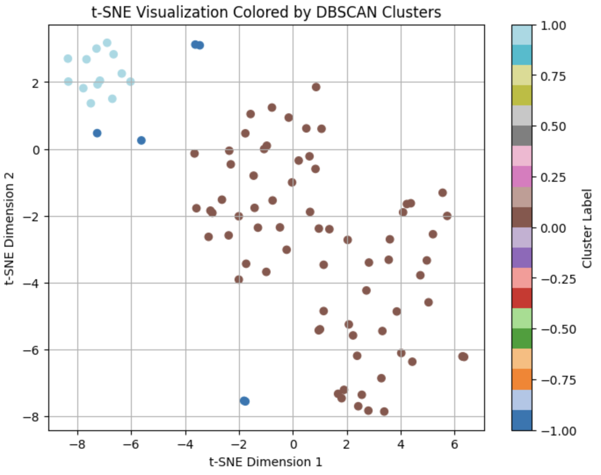

By comparing the two t-SNE visualizations, we can observe that when the number of clusters is 6, the data is divided into more and smaller clusters, revealing the local structure in greater detail. Some outliers or edge points may be separately assigned to small clusters, thereby making the clustering result more refined. However, this subdivision also leads to a decrease in the compactness within clusters and a less distinct separation between clusters compared to 2 clusters. The silhouette coefficient is only 0.2960, which is much lower than 0.3978 for 2 clusters. In contrast, when the number of clusters is 2, the samples within clusters are highly compact and the separation between clusters is obvious, resulting in a more stable overall clustering structure and higher clustering quality. Therefore, although 6 clusters can show local differences and potential outliers, from the perspective of global clustering quality and the interpretability of clusters, 2 clusters remain the best choice.

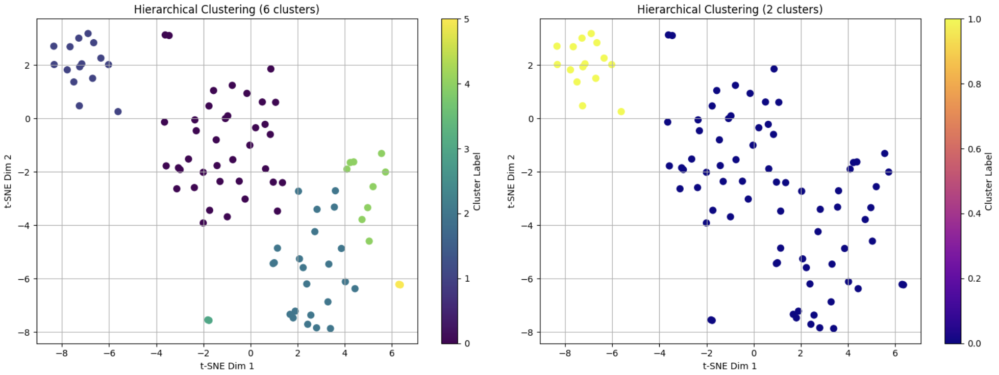

### Supervised Learning  

#### Linear Regression
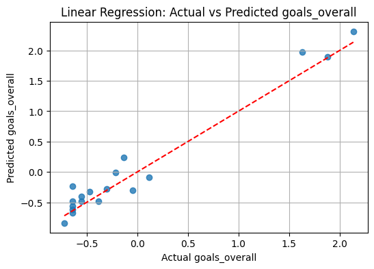
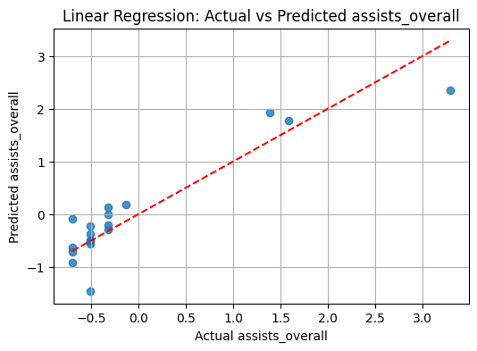

#### Regression Tree
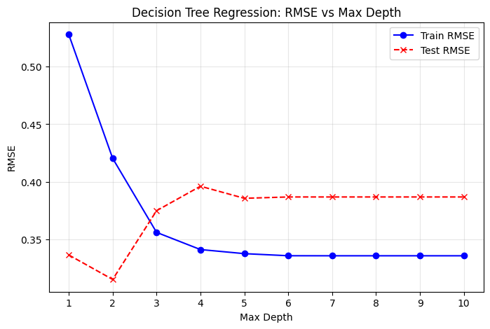

#### Multi-output Decision Tree Classifier
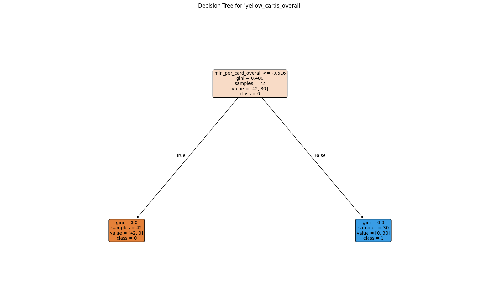
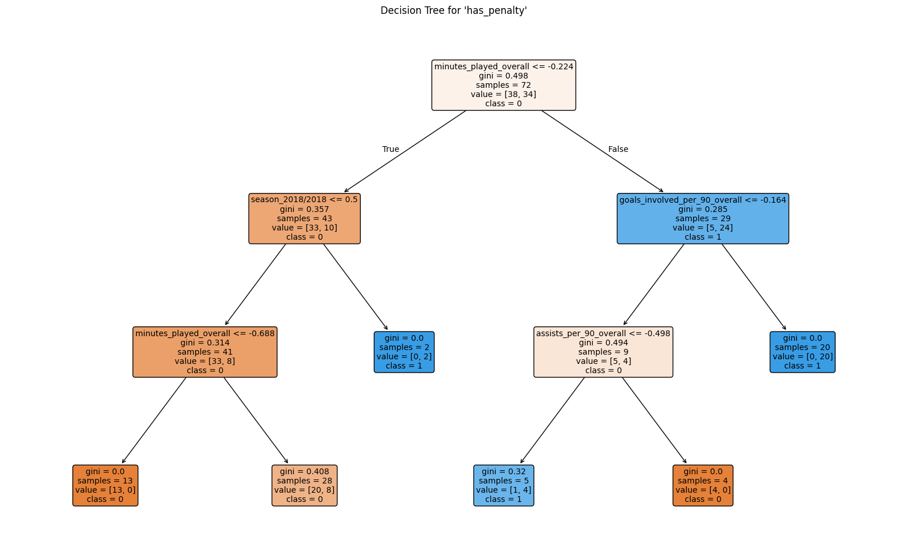

#### Multi-output Decision Tree Regressor
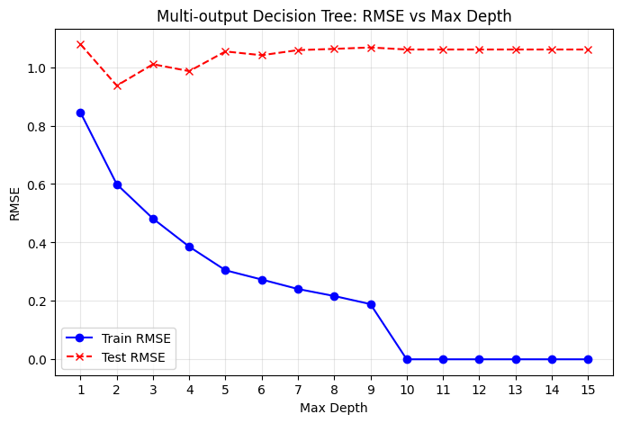

#### Multi-output Random Forest Regressor
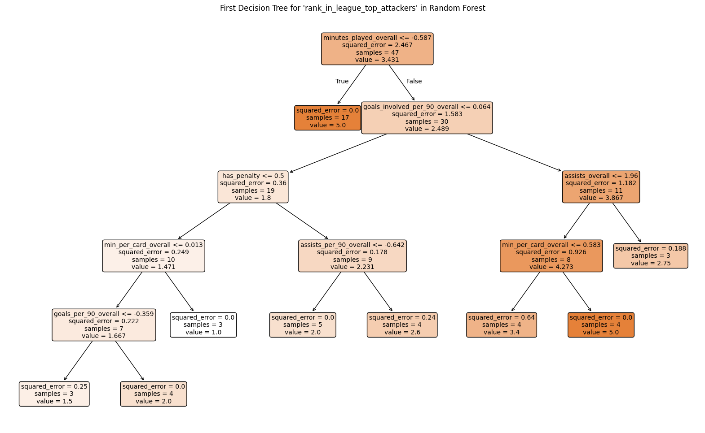
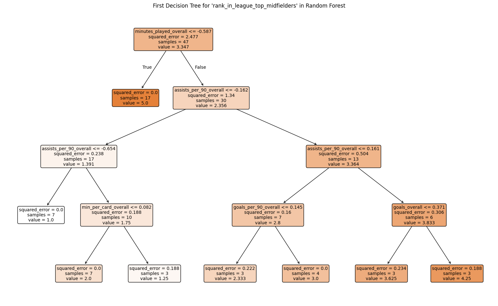

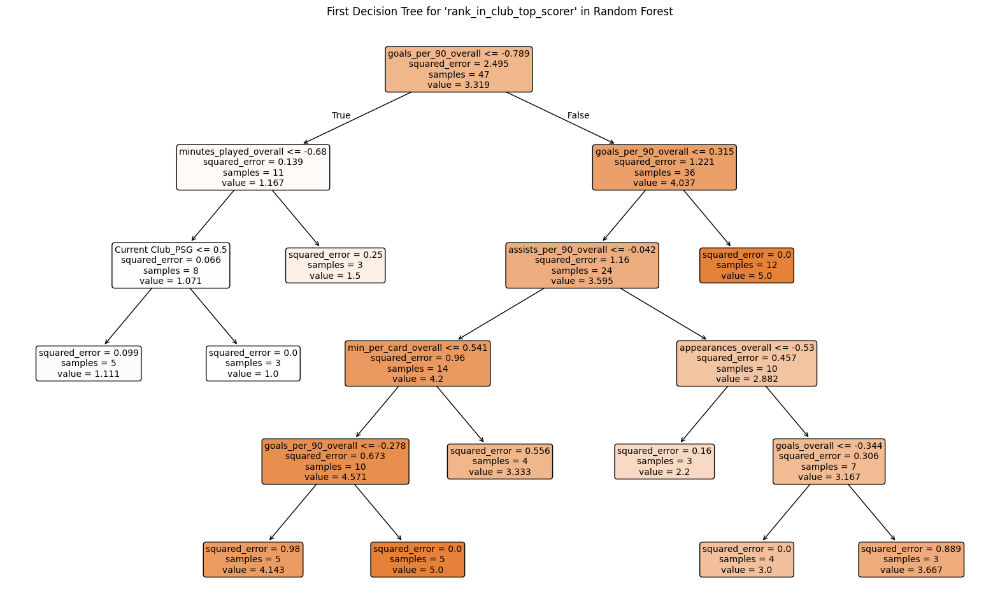

#### Multi-class Decision Tree Classification
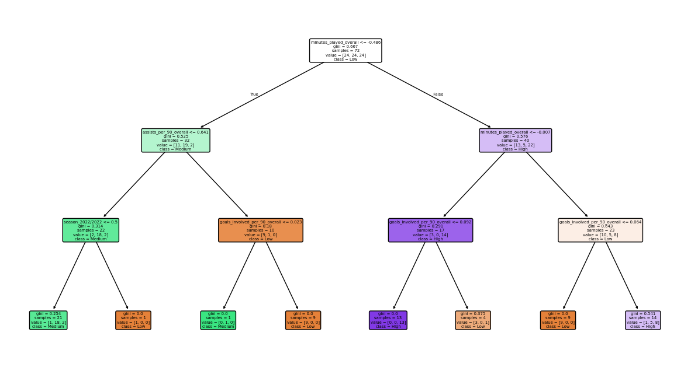

## Academic Contribution

- Applies advanced Data Science techniques to football player performance data.  
- Demonstrates how quantitative analysis can evaluate player performance in a more objective and structured method.  
- Check the performance of different machine learning models on real-world data.

## Social / Cultural Impact
- Use data to evaluate superstars in a more objective way, instead of based on feelings.
- Encourage sports fans to develop an interest in statistics and data science. 

